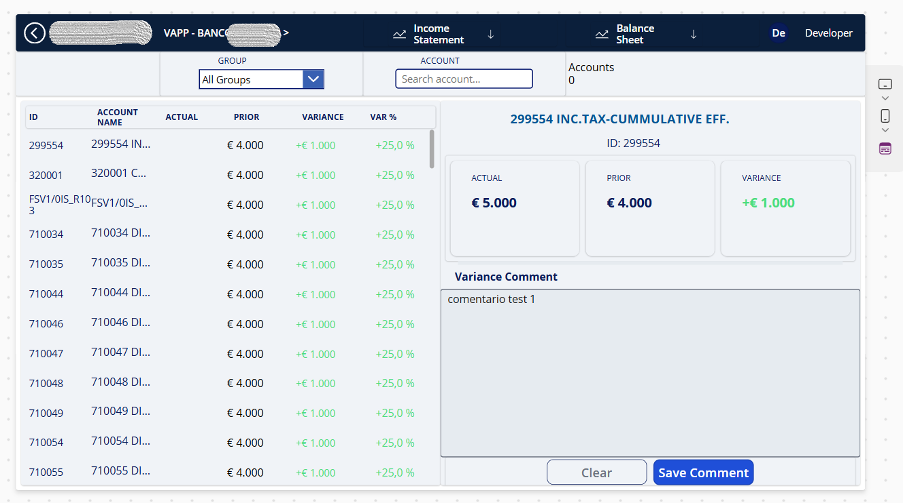
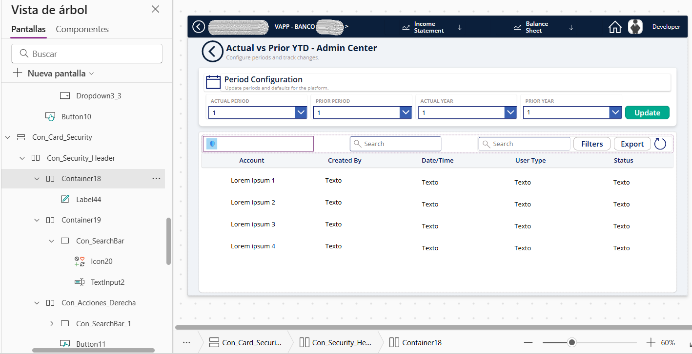
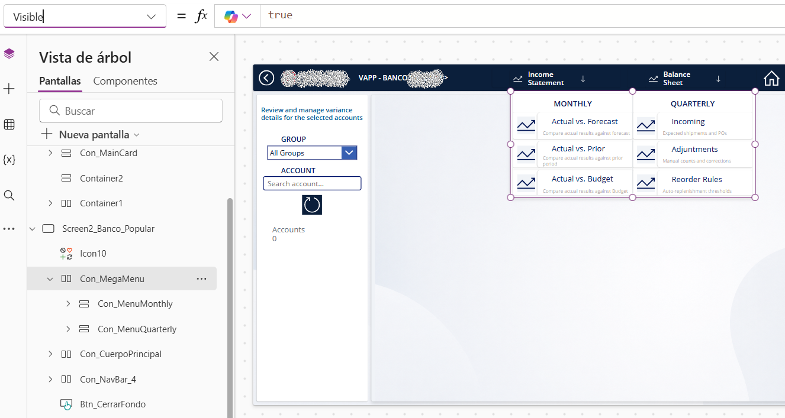
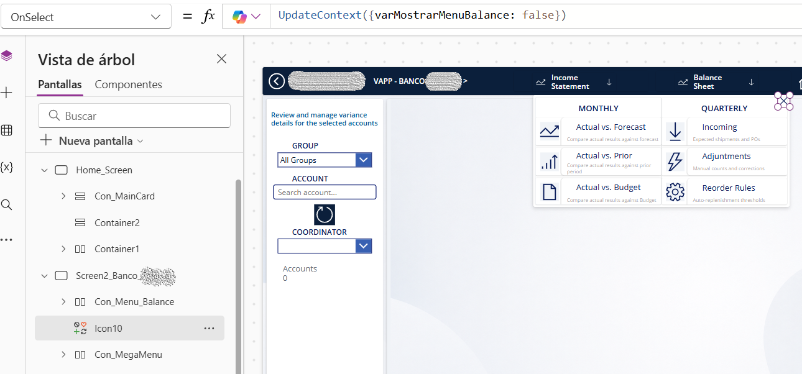
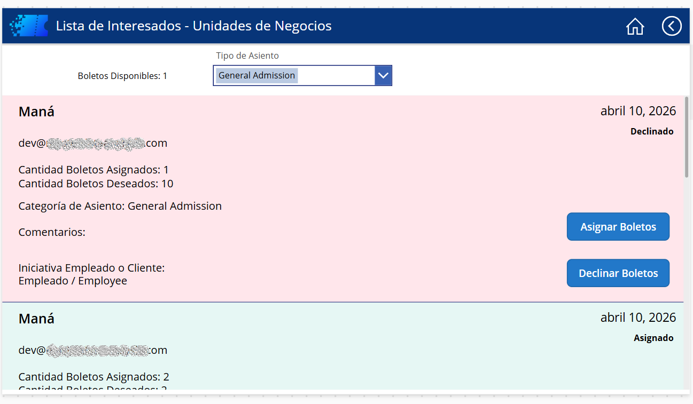

# 📱 Módulo Power Apps: Diseño de Interfaz Responsiva y Arquitectura Canvas

Este módulo documenta la arquitectura de frontend y la experiencia de usuario (UI/UX) desarrollada en **Power Apps Canvas**, enfocada en la gestión interactiva de datos corporativos y tableros analíticos de alto rendimiento.

---

## 🎯 Objetivo Técnico
Construir una interfaz moderna, adaptable y escalable que permita la visualización de métricas financieras y gestión operativa en tiempo real, garantizando rendimiento óptimo mediante el uso estricto de contenedores responsivos y delegación eficiente en PowerFx.

---

## 🛠️ Aspectos Destacados del Desarrollo

### 1. Panel de Control Financiero e Interfaz Split-View
Diseño de una vista dividida (*Split-View*) para el análisis de variaciones de presupuesto, permitiendo la exploración sintética y detallada en una misma pantalla.

*   **Puntos clave:**
    *   Integración de galerías personalizadas para listados masivos.
    *   Tarjetas de KPIs dinámicos (`ACTUAL`, `PRIOR`, `VARIANCE`).
    *   Módulo de comentarios de auditoría con persistencia de datos inmediata (`Save Comment`).

---

### 2. Arquitectura Modular con Contenedores Responsivos
Implementación de mejores prácticas de diseño mediante la estructuración jerárquica con contenedores (*Layout Containers*), evitando posiciones absolutas en favor de layouts adaptativos.

*   **Puntos clave:**
    *   Uso de `Con_Card_Security`, `Con_Security_Header` y contenedores anidados.
    *   Adaptabilidad automática a distintas resoluciones de pantalla (Desktop, Tablet y Mobile).

---

### 3. Mega Menú de Navegación Dinámica
Desarrollo de un componente de navegación tipo **Mega Menú** desplegable que organiza opciones analíticas mensuales y trimestrales.

*   **Puntos clave:**
    *   Diseño limpio orientado a la usabilidad (UI/UX).
    *   Control visual fluido sin necesidad de navegar entre múltiples pantallas independientes.

---

### 4. Gestión de Estado con PowerFx
Optimización de la lógica del frontend utilizando funciones de contexto local (`UpdateContext`) asociadas a eventos táctiles/click (`OnSelect`).

*   **Puntos clave:**
    *   Manejo de variables de contexto (`varMostrarMenuBalance`) para un control preciso de la memoria y velocidad de renderizado de la app.

---

### 5. Formato Condicional y Tarjetas de Estado
Diseño de galerías con retroalimentación visual dinámica basada en el estado de las solicitudes u operaciones procesadas.

*   **Puntos clave:**
    *   Reglas de colorimetría condicional (indicadores en verde para *Asignado* y rojo/rosado para *Declinado*).
    *   Facilidad de lectura y priorización visual para usuarios finales.

---

> ⬅️ **[Volver a la portada principal del repositorio](../../README.md)**
