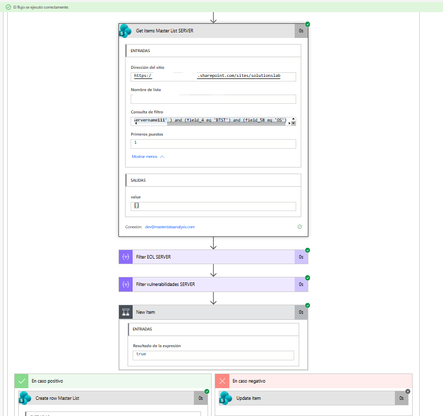
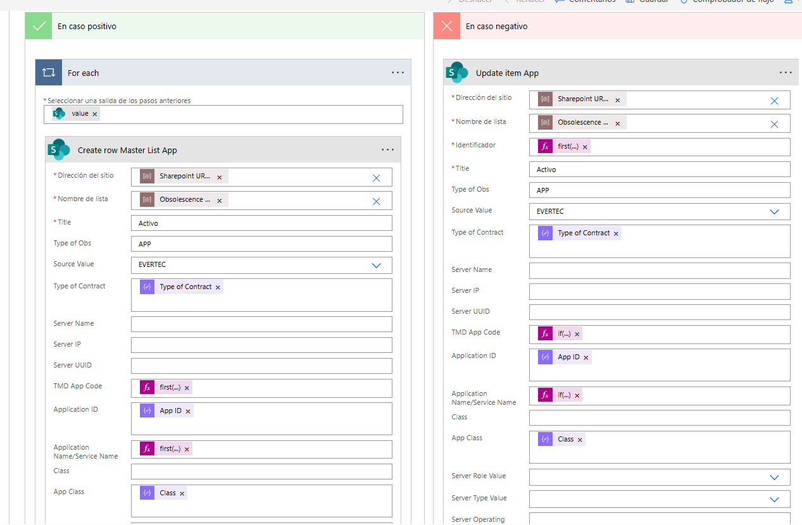
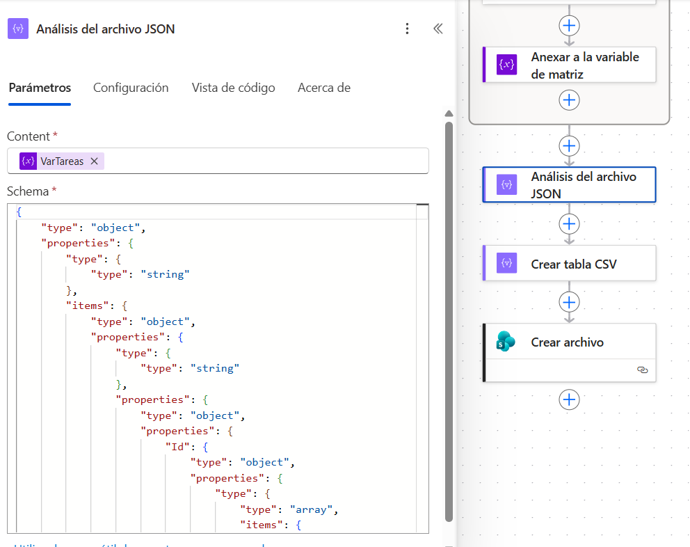
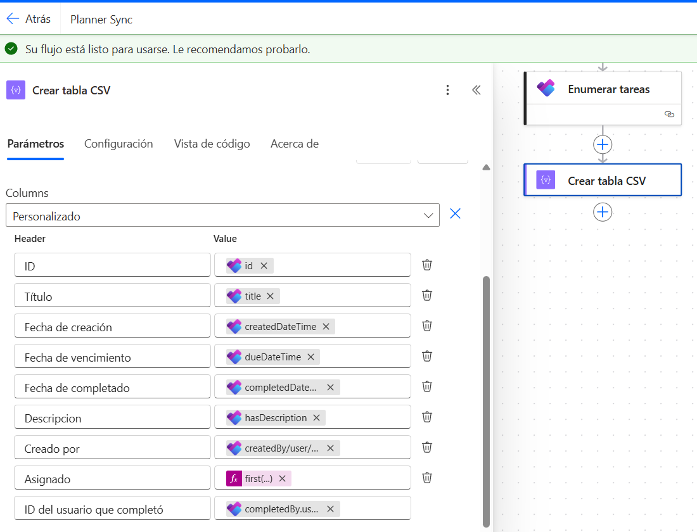
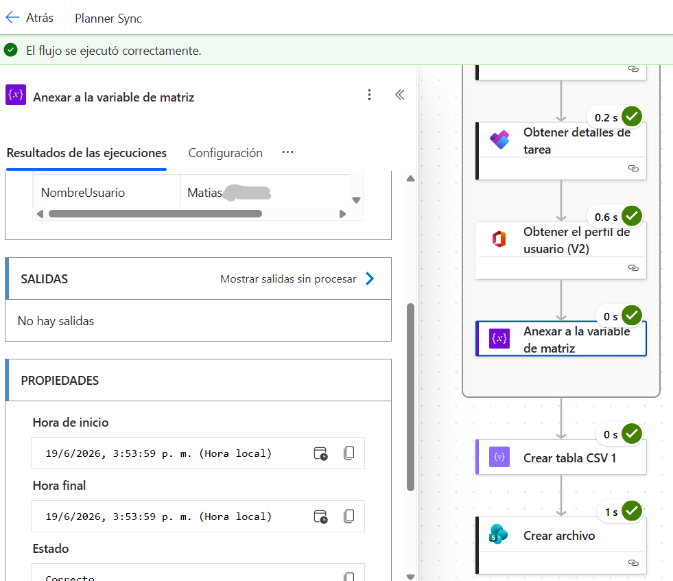

# ⚙️ Módulo Power Automate: Automatización e Integración de Procesos

Este módulo contiene la arquitectura de automatización desarrollada para la sincronización, procesamiento dinámico y generación de reportes a partir de Microsoft Planner y SharePoint Online.

---

## 🎯 Objetivo Técnico
Diseñar e implementar un flujo cloud robusto que elimine las búsquedas iterativas redundantes (hardcoded loops), optimizando el tiempo de ejecución mediante filtrado a nivel de API (OData), parseo de JSON dinámico y lógica condicional *Upsert* (Update/Insert).

---

## 🛠️ Aspectos Destacados de la Implementación

### 1. Optimización de Consultas mediante Filtros OData
Para evitar traer volúmenes masivos de datos a la memoria del flujo, las lecturas en SharePoint Online se parametrizaron utilizando expresiones de filtrado directo OData.

*   **Impacto:** Se redujo el payload de la respuesta HTTP y el consumo de recursos de la API de Microsoft 365, acelerando la ejecución general del proceso.

---

### 2. Lógica Condicional Upsert (Update / Insert)
Se estructuró una rama condicional para verificar la existencia previa de registros antes de procesarlos.

*   **Puntos clave:** 
    *   Uso de evaluación lógica (`En caso positivo` / `En caso negativo`).
    *   Implementación de funciones dinámicas como `first(...)` e `if(...)` para asegurar el mapeo correcto de datos sin generar registros duplicados.

---

### 3. Parseo y Tipado de Datos JSON
El flujo procesa payloads complejos extraídos de las APIs, aplicando un esquema estrictamente definido para la deserialización de los datos.

*   **Puntos clave:** Definición de un *Schema* JSON personalizado para estructurar variables de tipo array e identificadores únicos antes de su transformación final.

---

### 4. Generación Personalizada de Archivos Tabulares (CSV)
En lugar de exportar volcados genéricos, se diseñó una acción de generación de tabla CSV con mapeo dinámico de columnas y encabezados personalizados.

*   **Resultado:** Archivos de salida limpios, listos para ser consumidos directamente por tableros de Power BI o procesados en Microsoft Excel.

---

## 🚀 Resultados y Performance

Gracias a la optimización de expresiones y la eliminación de bucles innecesarios, el flujo registra ejecuciones en tiempos mínimos de respuesta (promedios entre 0.2s y 1s por subproceso).

---

> ⬅️ **[Volver a la portada principal del repositorio](../README.md)**
