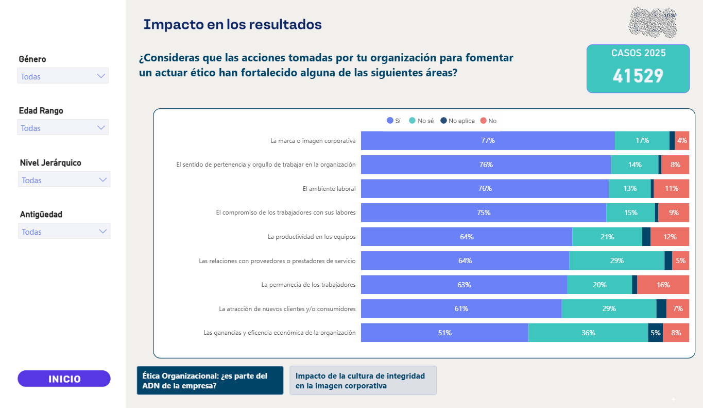
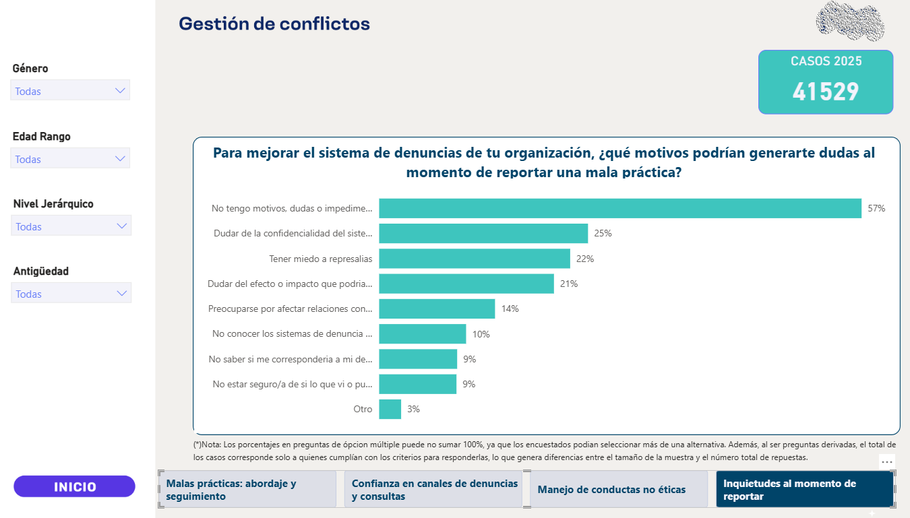
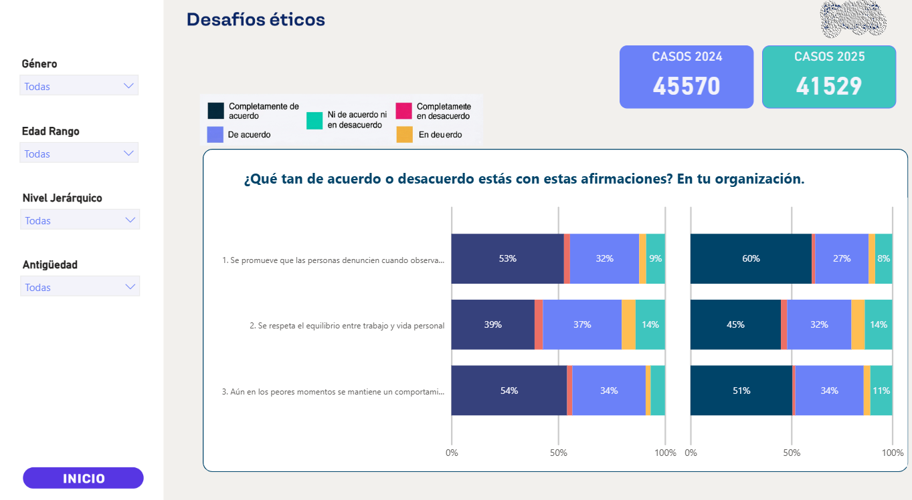
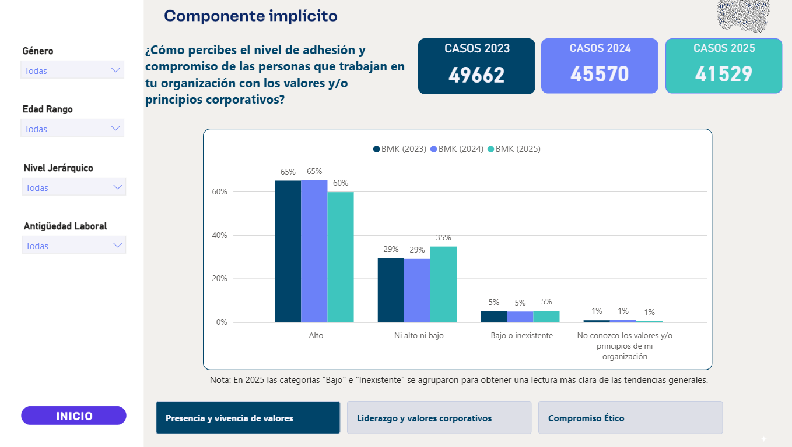
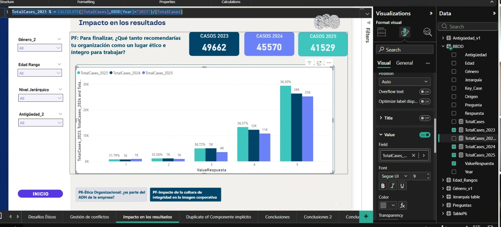

# 📊 Módulo Power BI: Tablero Analítico e Indicadores de Gestión

Este módulo documenta el diseño, modelado de datos y desarrollo de indicadores en **Power BI**, orientado al análisis estratégico de cultura organizacional, ética corporativa e impacto en los resultados institucionales.

---

## 🎯 Objetivo Técnico
Transformar datos complejos de encuestas anuales y registros operativos en un cuadro de mando interactivo, aplicando modelado relacional, medidas DAX optimizadas para benchmarking temporal y una navegación fluida entre dimensiones analíticas.

---

## 🛠️ Aspectos Destacados del Desarrollo

### 1. Análisis de Impacto y Fortalecimiento Organizacional
Visualización mediante barras apiladas al 100% para medir la percepción del impacto ético en áreas clave (Marca corporativa, Clima laboral, Productividad, etc.).



*   **Puntos clave:**
    *   Tarjetas de KPIs globales con volumen total de casos analizados (`CASOS 2025`).
    *   Segmentadores laterales dinámicos (*Género*, *Rango de Edad*, *Nivel Jerárquico*, *Antigüedad*).

---

### 2. Diagnóstico de Causas Raíz y Factores Críticos
Gráficos de ranking horizontal para la identificación rápida de barreras e inquietudes en los canales de reporte.



*   **Puntos clave:**
    *   Formateo de etiquetas con porcentajes relativos sobre el total de respuestas.
    *   Navegación por pestañas inferiores para profundizar en distintas categorías de gestión de conflictos.

---

### 3. Benchmarking Interanual de Desafíos Éticos
Estructuración de gráficos paralelos para la comparación directa de comportamientos y acuerdos entre periodos fiscales (2024 vs. 2025).



*   **Puntos clave:**
    *   Escala 100% apilada para homologar respuestas cualitativas (Likert).
    *   Evolución métrica interanual de la muestra de casos.

---

### 4. Tendencia Trianual de Adhesión a Valores Corporativos
Análisis de series temporales agrupando métricas de tres periodos consecutivos (2023, 2024 y 2025).



*   **Puntos clave:**
    *   Seguimiento de la evolución de niveles (Alto, Medio, Bajo) a lo largo del tiempo.
    *   KPIs de cabecera sincronizados dinámicamente con el filtro de contexto.

---

### 5. Modelado de Métricas con DAX Avanzado
Uso de medidas explícitas para cálculos proporcionales y filtrado contextual sobre el modelo relacional.



*   **Expresión destacada:**
    ```dax
    TotalCases_2023 % = CALCULATE([TotalCases], BBDD[Year]="2023") / [TotalCases]
    ```

---

> ⬅️ **[Volver a la portada principal del repositorio](../../README.md)**
